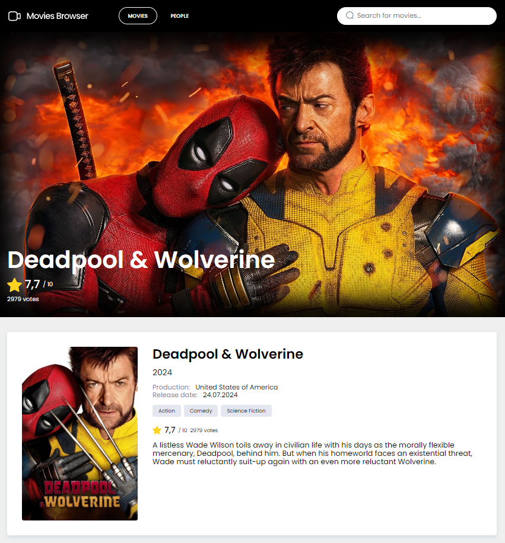

# 🎬 Movie Browser App

Welcome to **Movie Browser App** — an interactive application that allows you to browse the most popular movies and actors using the power of the [The Movie Database (TMDB) API](https://www.themoviedb.org/documentation/api). Discover the latest hits, explore movie details, and dive into the world of your favorite actors!

## ✨ Features

- 🔍 **Browse Movies**: Discover a wide range of popular and trending movies in real-time, thanks to integration with the TMDB (The Movie Database) API. Get up-to-date information about current releases and popular titles.
  
- 🎥 **Movie Details**: Dive deep into the specifics of any movie with detailed information, including:
  - **Title** and **Release Date**: Find out when your favorite films were released.
  - **Genre Tags**: Explore genres like Action, Drama, Comedy, and more, to easily discover movies that fit your preferences.
  - **Average Rating and Total Votes**: Check the community's ratings, displayed with star icons and formatted scores.
  - **Movie Poster and Backdrop**: View high-quality posters and backdrop images.
  - **Plot Summary**: Get a concise overview of the movie's storyline.

- 👤 **Actor Profiles**: Access detailed profiles of actors and crew members, including:
  - **Filmography**: View all the movies they've been part of, both as actors and in other roles, with links to individual movie pages.
  - **Personal Information**: Check details such as birthdate, place of birth, and short biographies.
  - **Profile Photos**: Explore a visual gallery with profile images of the actors and crew.

- 🔄 **Pagination**: Smoothly navigate through extensive lists of movies and actors with efficient pagination:
  - Pagination is optimized for large data sets, making it easy to browse multiple pages of results without performance issues.
  - URL-based parameters allow users to share links with specific pages and search queries.

- 📱 **Responsive Design**: The app is fully responsive and optimized for all devices:
  - **Mobile First**: Designed with mobile users in mind, ensuring smooth performance and user experience on smaller screens.
  - **Desktop Friendly**: On larger screens, enjoy expanded layouts with additional details and more images displayed.
  
- 🔎 **Search Functionality**: Easily find movies or actors using the search feature, with results dynamically fetched based on user input.
  
- 📊 **Ratings Display**: Both in detailed views and list views, movie ratings are presented in a user-friendly way, showing the average rating and total number of votes. Scores are formatted with precision and localized number formats.

- 🛠️ **Error Handling & Feedback**:
  - **Loading Indicators**: The app displays smooth loading spinners to ensure users know when content is being fetched.
  - **No Results Messages**: When no results match the search criteria, users are informed with clear messages.

- 🏷️ **Dynamic Genre Mapping**: Each movie is tagged with relevant genres, which are dynamically loaded from TMDB’s API. The app efficiently maps genre IDs to their names, making movie browsing more intuitive.

- 🎨 **Fallback Assets**: Default images and error messages are shown when there are missing data points (such as a missing movie poster or actor profile image), ensuring a seamless visual experience.

## 🚀 Live Demo

👉 [Movie Browser App](https://adamgralak.github.io/movies-browser/#/movies)

## 🛠️ Technologies Used

This app is built using modern web technologies to ensure high performance, clean code, and maintainability.

### Frontend Technologies
- **HTML**: Structuring the content of the application.
- **CSS**: Styling the components and layouts.
- **JavaScript (ES6+)**: The backbone of the application, leveraging modern JavaScript features.

### Core Libraries & Tools
- **React**: Core library for building the user interface.
  - **React-Router**: For seamless navigation between different sections of the app.
  - **useState**: React hook for managing component-level state.
  - **useEffect**: React hook for managing side-effects in components.
  - **useLocation**: For accessing the current location of the app.
  - **useHistory**: For navigating programmatically between routes.
  - **custom hooks**: For encapsulating and reusing logic.
- **Redux Toolkit**: State management for handling complex state and async API requests.
  - **@reduxjs/toolkit**: For simplifying Redux setup and logic.
  - **react-redux**: For connecting React components to the Redux store.
- **Redux Saga**: Handling side effects (like API requests) in a scalable and predictable way.
  - **JS-generators**: For handling asynchronous actions in Redux Saga.
- **TMDB API**: For retrieving real-time data on movies and actors.
- **Webpack**: Module bundler to compile the project and serve optimized assets.
- **Babel**: Transpiler to ensure compatibility with older browsers.
- **create-react-app**: Bootstrap tool to set up the React environment.

### CSS Techniques
- **Grid layout**: For creating flexible and responsive layouts.
- **Flexbox**: For aligning items within containers.
- **@media queries**: For making the design responsive across different screen sizes.
- **Styled Components**: For writing clean, reusable, and scoped CSS in JavaScript.

## 📸 Screenshots

### 🏠 Home Page

### 📖 Movie Details

### 👤 Actor Profiles

# Happy movie browsing! 🍿🎬

## Getting Started with Create React App

This project was bootstrapped with [Create React App](https://github.com/facebook/create-react-app).

## Available Scripts

In the project directory, you can run:

### `npm start`

Runs the app in the development mode.\
Open [http://localhost:3000](http://localhost:3000) to view it in your browser.

The page will reload when you make changes.\
You may also see any lint errors in the console.

### `npm run build`

Builds the app for production to the `build` folder.\
It correctly bundles React in production mode and optimizes the build for the best performance.

The build is minified and the filenames include the hashes.\
Your app is ready to be deployed!

See the section about [deployment](https://facebook.github.io/create-react-app/docs/deployment) for more information.

## Learn More

You can learn more in the [Create React App documentation](https://facebook.github.io/create-react-app/docs/getting-started).

To learn React, check out the [React documentation](https://reactjs.org/).
